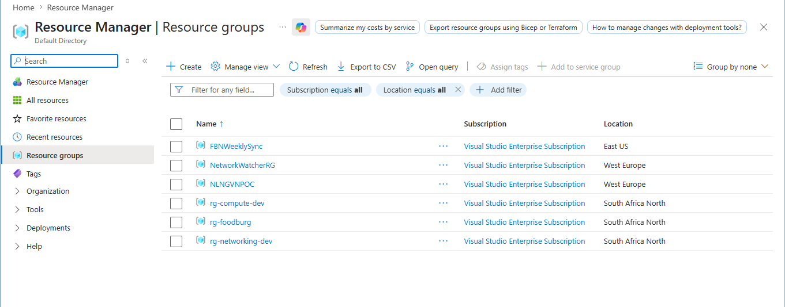
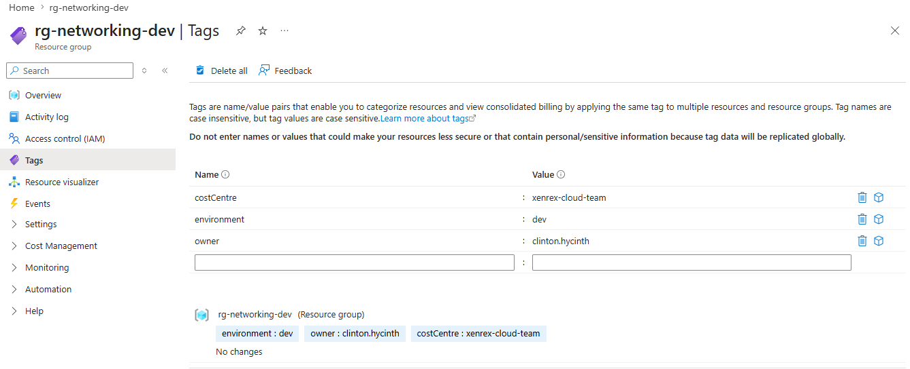
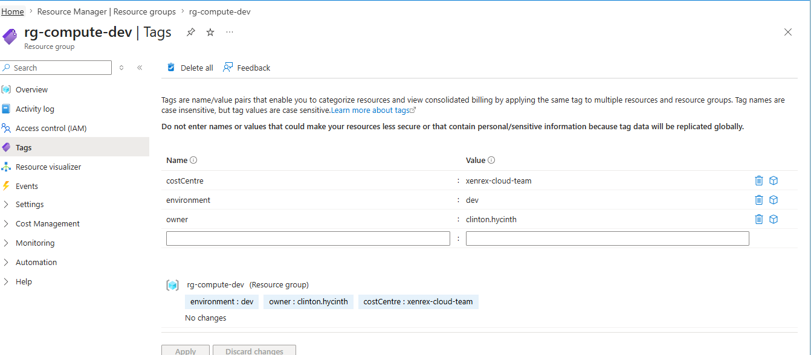
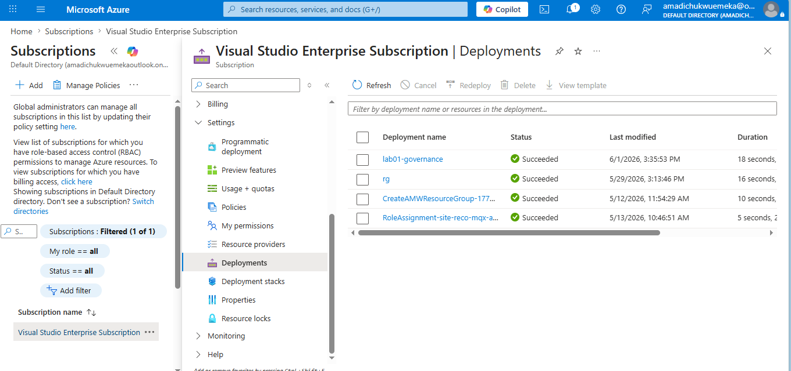

# Lab 01: Resource Groups and Tagging Governance

## What this lab does

Deploys two resource groups at subscription scope using Bicep:

- `rg-networking-dev` for all networking resources
- `rg-compute-dev` for all compute resources

Enforces three mandatory tags on both resource groups:

- `environment`: identifies the deployment environment (dev or prod)
- `owner`: identifies the team or individual responsible
- `costCentre`: identifies the billing unit

## Why it matters

Every real Azure environment starts with governance. Separating networking and compute into distinct resource groups allows independent access control and cleaner resource management. Tagging from the start ensures resources are traceable, auditable, and aligned with cost management requirements.

## Resources deployed

| Resource                  | Name              | Type                               |
| ------------------------- | ----------------- | ---------------------------------- |
| Networking Resource Group | rg-networking-dev | Microsoft.Resources/resourceGroups |
| Compute Resource Group    | rg-compute-dev    | Microsoft.Resources/resourceGroups |

## Deployment command

```bash
az deployment sub create \
  --name lab01-governance \
  --location southafricanorth \
  --template-file main.bicep \
  --parameters @dev.parameters.json
```

## AZ-104 alignment

- Manage Azure identities and governance
- Resource groups, tags, and governance structure

## Evidence

### Resource groups deployed



### Tags on rg-networking-dev



### Tags on rg-compute-dev



### Successful deployment


