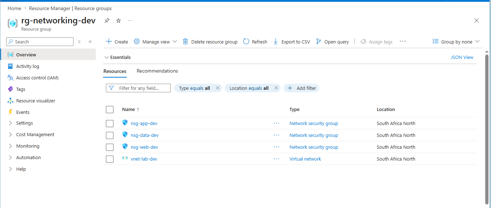
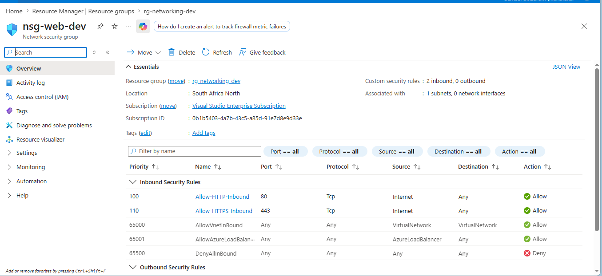
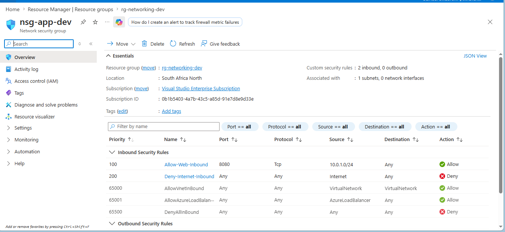
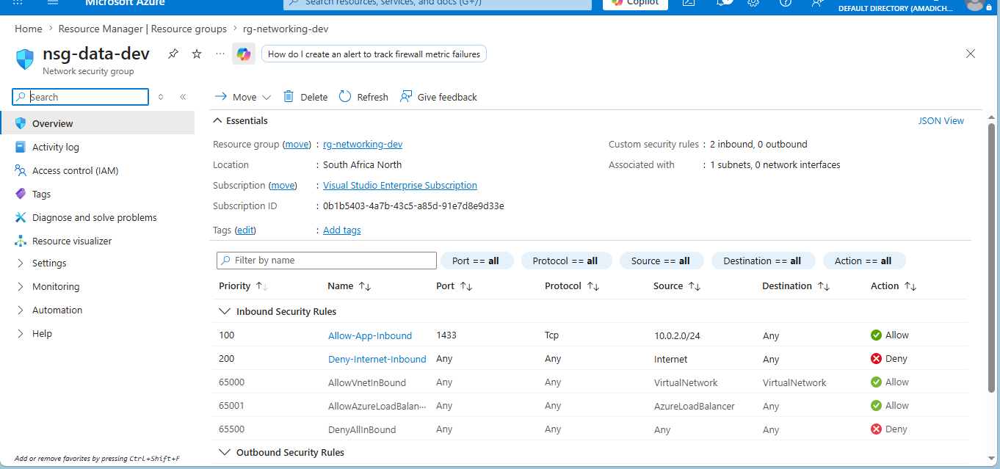
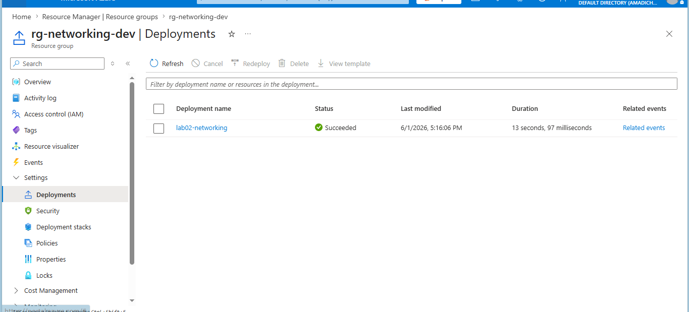

# Lab 02: Virtual Network with Subnets and NSGs

## What this lab does

Deploys a Virtual Network with three subnets into `rg-networking-dev`, each associated to its own Network Security Group:

- `snet-web`: public-facing tier, allows HTTP and HTTPS from the internet
- `snet-app`: application tier, only reachable from the web subnet
- `snet-data`: data tier, only reachable from the app subnet on port 1433

## Why it matters

Network segmentation limits how far an attacker can move if one tier is compromised. Each subnet has its own NSG with rules that enforce the principle of least privilege at the network level. No tier exposes more access than it needs.

## Resources deployed

| Resource        | Name         | Type                                    |
| --------------- | ------------ | --------------------------------------- |
| Virtual Network | vnet-lab-dev | Microsoft.Network/virtualNetworks       |
| Web NSG         | nsg-web-dev  | Microsoft.Network/networkSecurityGroups |
| App NSG         | nsg-app-dev  | Microsoft.Network/networkSecurityGroups |
| Data NSG        | nsg-data-dev | Microsoft.Network/networkSecurityGroups |

## Deployment command

```bash
az deployment group create \
  --name lab02-networking \
  --resource-group rg-networking-dev \
  --template-file main.bicep \
  --parameters @dev.parameters.json
```

## AZ-104 alignment

- Configure and manage virtual networking
- Virtual networks, subnets, and network security groups
- Network segmentation and traffic control

## Evidence

### 01-VNet and subnets deployed



### 02-NSG rules on nsg-web-dev



### 03-NSG rules on nsg-app-dev



### 04-NSG rules on nsg-data-dev



### 05-Successful deployment


