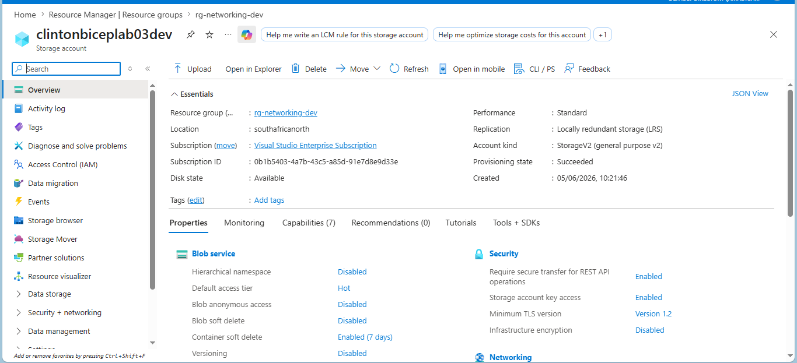
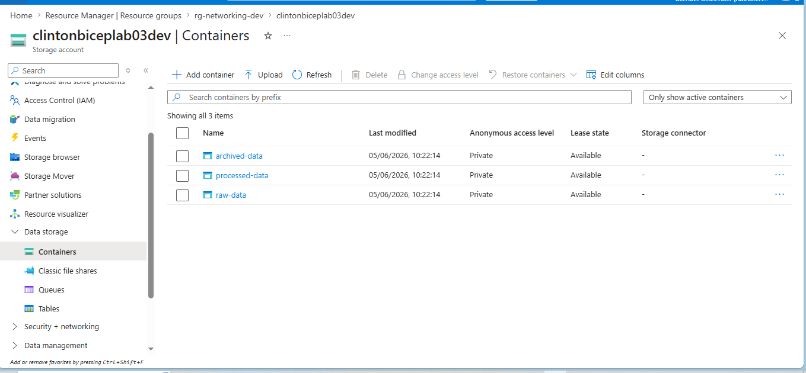
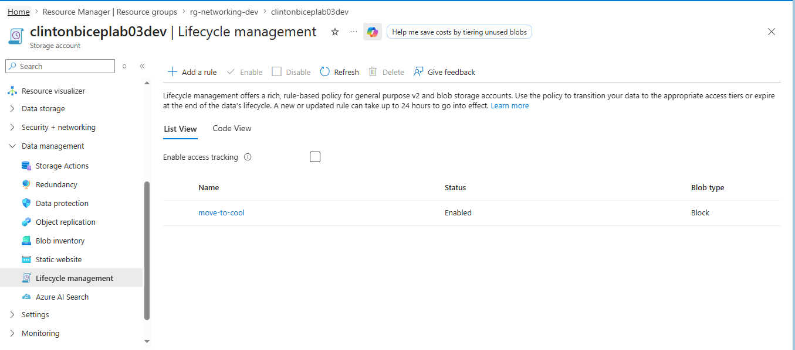
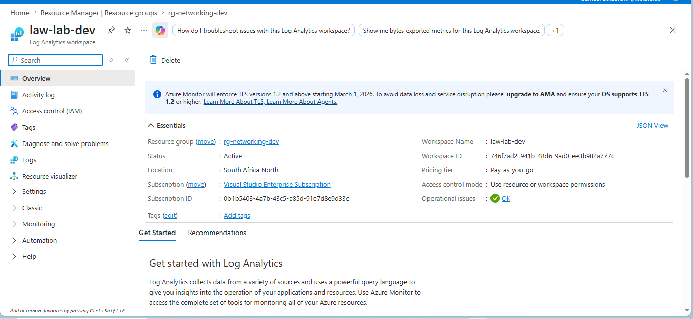
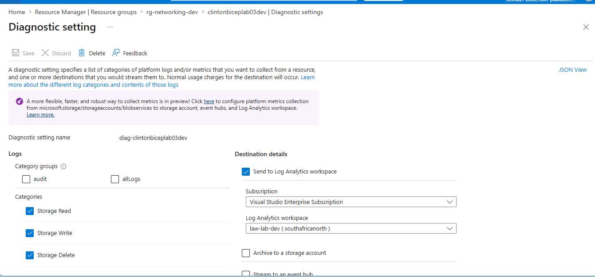
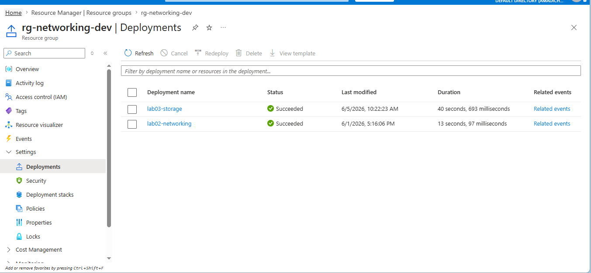

# Lab 03: Storage Account with Lifecycle Management and Diagnostics

## What this lab does

Deploys a storage account with three blob containers, a lifecycle management
policy, and diagnostic settings into `rg-networking-dev` using Bicep.

A Log Analytics workspace is also created in this lab and will be referenced
by all subsequent labs for centralised monitoring.

## Why it matters

Storage is never just create and forget. Data has a lifecycle. Keeping
frequently accessed data on the Hot tier and rarely accessed data on the same
tier wastes money. Lifecycle management automates that cost optimisation.

Diagnostics provide visibility into who is accessing storage, when, and how.
Without logs flowing to a workspace, you are blind to activity on your
storage account.

## Resources deployed

| Resource                | Name                      | Type                                                      |
| ----------------------- | ------------------------- | --------------------------------------------------------- |
| Storage Account         | clintonbiceplab03dev      | Microsoft.Storage/storageAccounts                         |
| Blob Container          | raw-data                  | Microsoft.Storage/storageAccounts/blobServices/containers |
| Blob Container          | processed-data            | Microsoft.Storage/storageAccounts/blobServices/containers |
| Blob Container          | archived-data             | Microsoft.Storage/storageAccounts/blobServices/containers |
| Lifecycle Policy        | default                   | Microsoft.Storage/storageAccounts/managementPolicies      |
| Log Analytics Workspace | law-lab-dev               | Microsoft.OperationalInsights/workspaces                  |
| Diagnostic Settings     | diag-clintonbiceplab03dev | Microsoft.Insights/diagnosticSettings                     |

## Lifecycle policy rules

| Rule            | Trigger                          | Action                  |
| --------------- | -------------------------------- | ----------------------- |
| Move to Cool    | 30 days since last modification  | Tier changed to Cool    |
| Move to Archive | 90 days since last modification  | Tier changed to Archive |
| Delete          | 365 days since last modification | Blob deleted            |

## Deployment command

```bash
az deployment group create \
  --name lab03-storage \
  --resource-group rg-networking-dev \
  --template-file main.bicep \
  --parameters @dev.parameters.json
```

## AZ-104 alignment

- Implement and manage storage
- Storage accounts, access tiers, lifecycle management
- Diagnostic settings and Log Analytics workspace

## Evidence

### Storage account and containers deployed



### Blob containers



### Lifecycle management policy



### Log Analytics workspace



### Diagnostic settings



### Successful deployment


