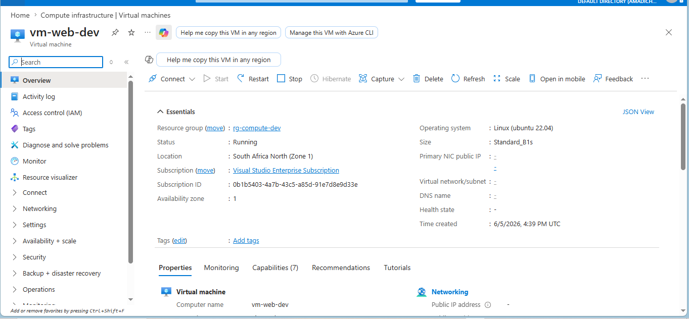
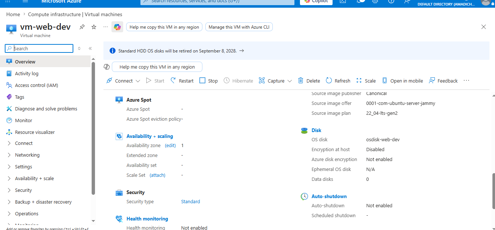
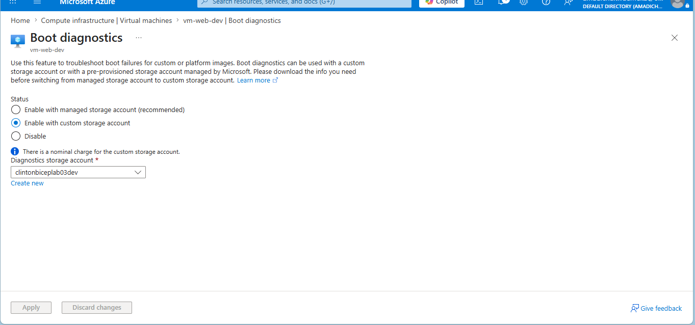
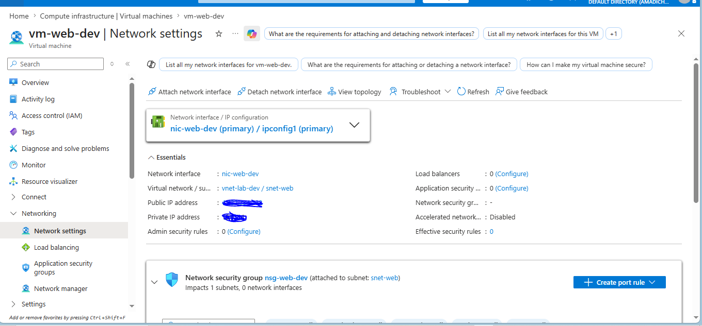
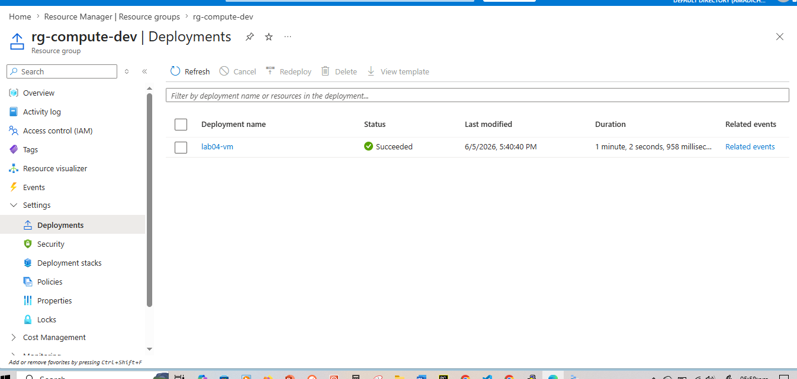

# Lab 04: Linux VM with Availability Zone and Boot Diagnostics

## What this lab does

Deploys a Linux Virtual Machine into `rg-compute-dev` using Bicep. The VM
sits in `snet-web` from Lab 02, uses boot diagnostics pointing to the storage
account from Lab 03, and is placed in availability zone 1 for resiliency.

This lab brings together the network from Lab 02 and the storage from Lab 03,
demonstrating how a real Azure environment is built incrementally.

## Engineering decisions

**Availability zone assignment:** A VM with no zone assignment can be taken
down by a single rack failure in the datacentre. Zone placement ensures the VM
has independent power, cooling, and networking from other zones.

**SSH key authentication only:** Password authentication is disabled. Passwords
on internet-facing VMs are a security risk. SSH keys are the correct baseline
for Linux VM access in Azure.

**Standard SKU public IP, static allocation:** Standard SKU is required for
zone assignment and is a prerequisite for the Standard Load Balancer we add in
Lab 05. Static allocation ensures the IP address does not change between
restarts.

**Boot diagnostics pointed at Lab 03 storage account:** If the VM fails to
start, the serial console logs and boot screenshots are captured in the storage
account. Without this, diagnosing a failed boot means guessing.

**Standard_B1s VM size:** The smallest burstable VM size in Azure. Sufficient
for a lab environment and cost-efficient for a shared subscription.

## Resources deployed

| Resource          | Name           | Type                                |
| ----------------- | -------------- | ----------------------------------- |
| Virtual Machine   | vm-web-dev     | Microsoft.Compute/virtualMachines   |
| Network Interface | nic-web-dev    | Microsoft.Network/networkInterfaces |
| Public IP Address | pip-web-dev    | Microsoft.Network/publicIPAddresses |
| OS Disk           | osdisk-web-dev | Microsoft.Compute/disks             |

## Deployment command

```bash
az deployment group create \
  --name lab04-vm \
  --resource-group rg-compute-dev \
  --template-file main.bicep \
  --parameters @dev.parameters.json
```

## AZ-104 alignment

- Deploy and manage Azure compute resources
- Virtual machines, availability zones, boot diagnostics
- NIC configuration and public IP assignment

## Evidence

### VM deployed and running



### VM availability zone assignment



### Boot diagnostics enabled



### NIC attached to snet-web



### Successful deployment


