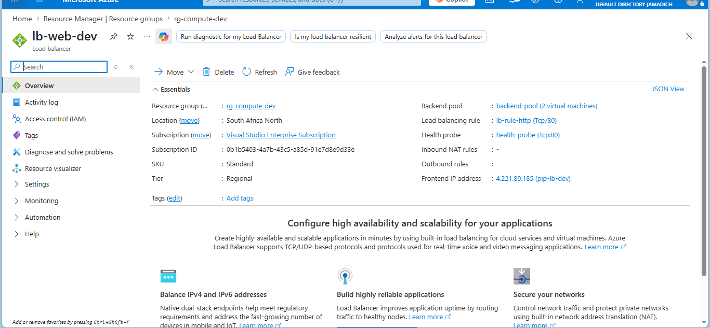
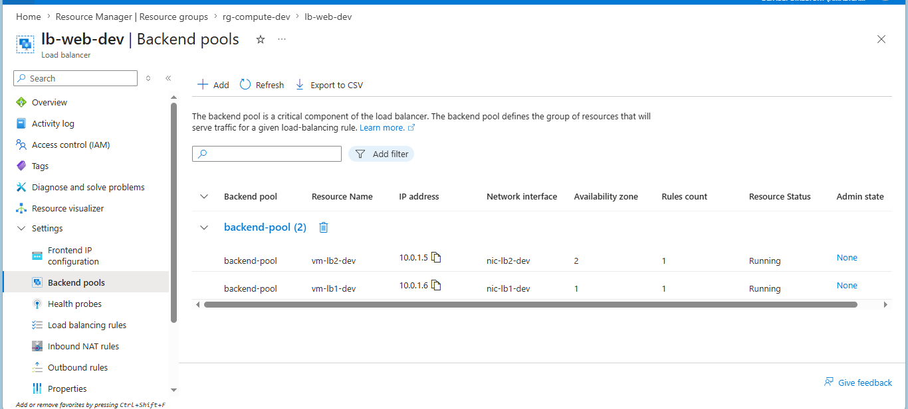
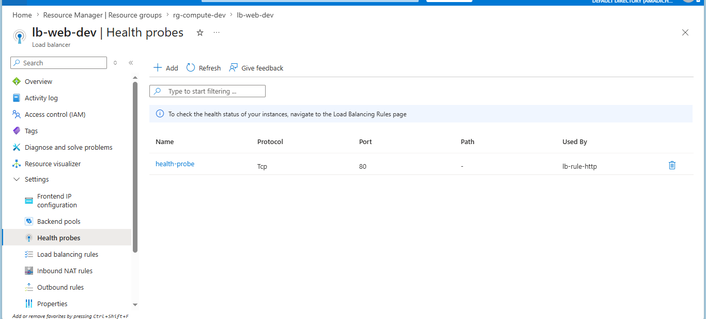
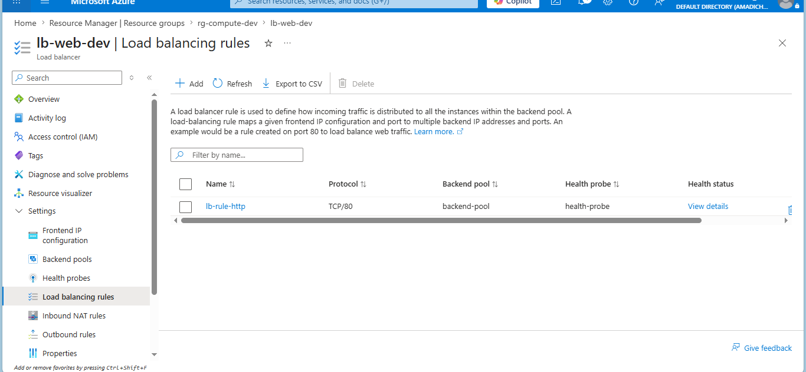
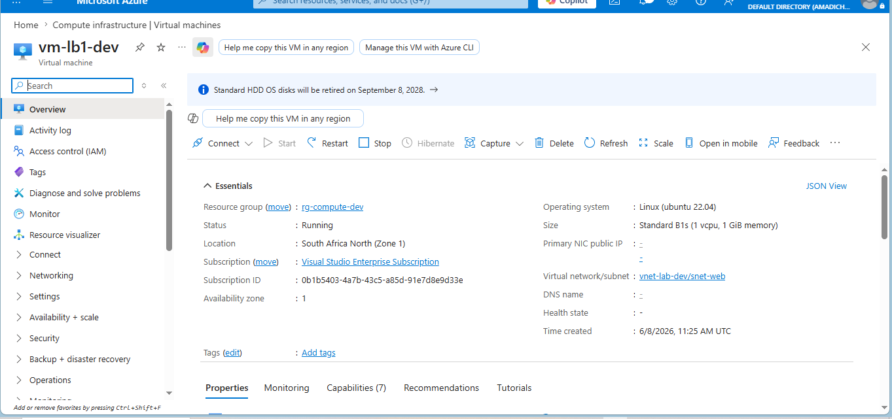
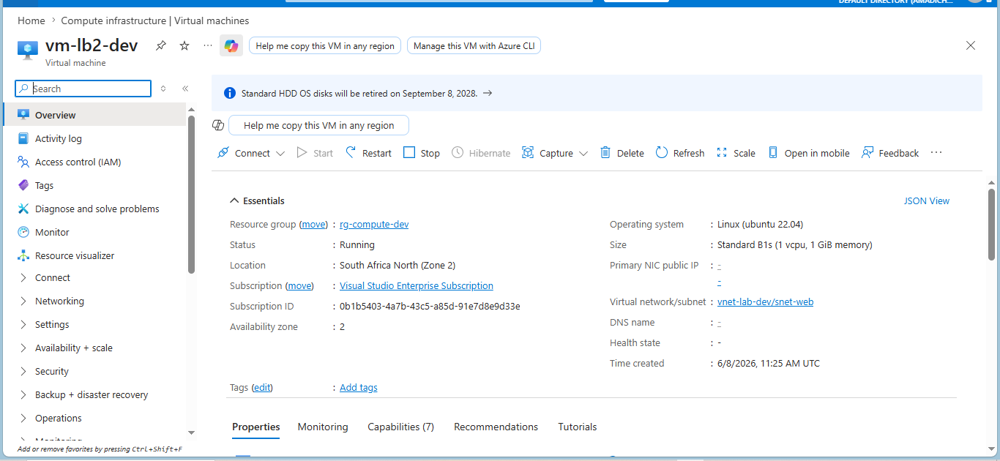
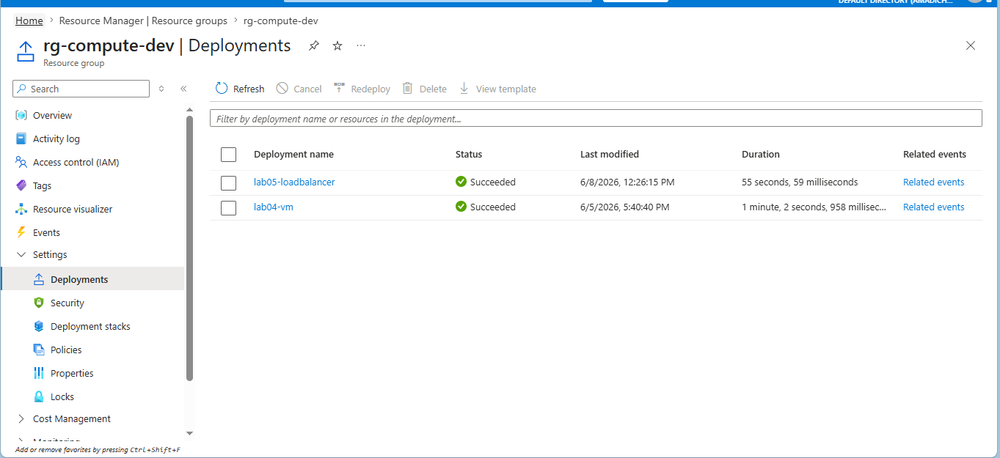

# Lab 05: Load Balancer with Backend Pool and Health Probe

## What this lab does

Deploys a Standard Load Balancer with two Linux VMs in `rg-compute-dev`
using Bicep. Both VMs sit in `snet-web` from Lab 02, are placed in separate
availability zones, and are registered in the load balancer backend pool from
deployment.

This lab builds on Lab 02 (networking), Lab 03 (storage/diagnostics), and
Lab 04 (VM deployment pattern) to deliver a highly available web tier.

## Engineering decisions

**Two VMs across two availability zones:** VM 1 is in zone 1, VM 2 is in
zone 2. A zone failure takes down one VM, not both. Traffic continues flowing
through the surviving VM without interruption.

**Standard Load Balancer SKU:** Standard SKU is required for zone-redundant
deployments. Basic SKU does not support availability zones. This is a
deliberate choice, not a default.

**No public IPs on individual VMs:** The VMs in this lab have no public IPs
of their own. All traffic enters through the load balancer frontend IP. This
reduces the attack surface. There is no direct path to the VMs from the
internet.

**TCP health probe on port 80, 15 second interval, 2 probe threshold:** The
load balancer checks each VM every 15 seconds. If a VM fails 2 consecutive
checks it is removed from rotation automatically. Users are never routed to
an unhealthy VM.

**Backend pool association at NIC level:** Both NICs are registered to the
backend pool at deployment time. No manual portal configuration required.

**Loop-based deployment:** Both VMs and NICs are deployed using a Bicep loop
over a configuration array. This is cleaner than duplicating resource blocks
and scales easily if more VMs are needed.

## Resources deployed

| Resource      | Name        | Type                                |
| ------------- | ----------- | ----------------------------------- |
| Load Balancer | lb-web-dev  | Microsoft.Network/loadBalancers     |
| LB Public IP  | pip-lb-dev  | Microsoft.Network/publicIPAddresses |
| VM 1          | vm-lb1-dev  | Microsoft.Compute/virtualMachines   |
| VM 2          | vm-lb2-dev  | Microsoft.Compute/virtualMachines   |
| NIC 1         | nic-lb1-dev | Microsoft.Network/networkInterfaces |
| NIC 2         | nic-lb2-dev | Microsoft.Network/networkInterfaces |

## Deployment command

```bash
az deployment group create \
  --name lab05-loadbalancer \
  --resource-group rg-compute-dev \
  --template-file main.bicep \
  --parameters @dev.parameters.json
```

## AZ-104 alignment

- Deploy and manage Azure compute resources
- Configure and manage virtual networking
- Load Balancer, backend pools, health probes, availability zones

## Evidence

### Load balancer deployed



### Backend pool with both VMs



### Health probe configuration



### Load balancing rule



### Both VMs running in separate zones




### Successful deployment


