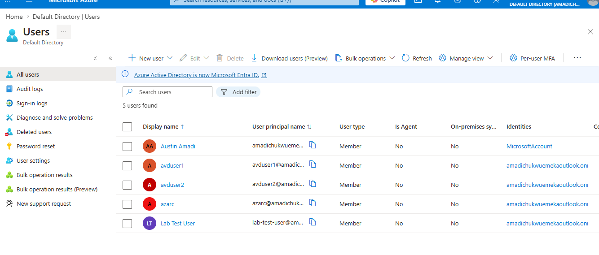
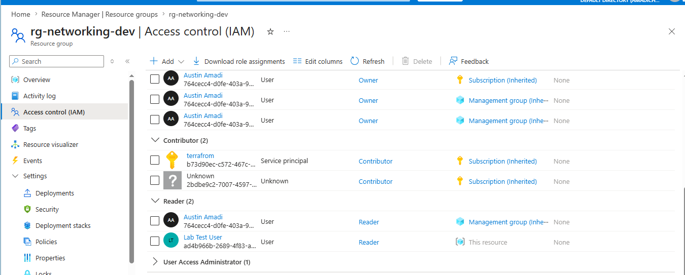
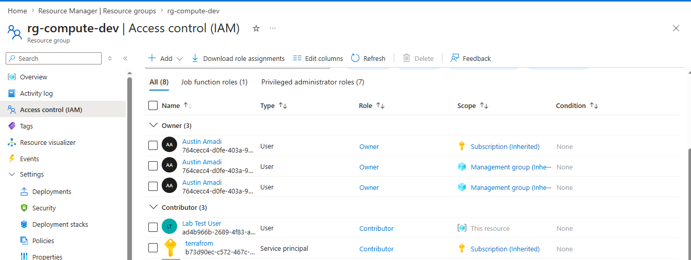
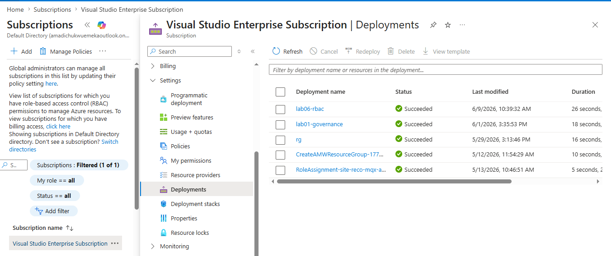

# Lab 06: RBAC Role Assignments via Bicep

## What this lab does

Deploys two role assignments at resource group scope using Bicep:

- Reader role on `rg-networking-dev` for a test user
- Contributor role on `rg-compute-dev` for the same test user

A test user was created in Azure Active Directory specifically for this lab
to demonstrate realistic access management. Role assignments are deployed as
code, not configured manually through the portal.

## Why it matters

In most organisations, access control is managed manually through the portal.
Someone joins the team, someone clicks through the portal and assigns a role.
When they leave, someone has to remember to remove it. That is error-prone
and unauditable.

Deploying role assignments as Bicep means every access decision is
version-controlled, reviewable, and repeatable. Access control becomes
part of the infrastructure, not an afterthought.

## Engineering decisions

**Resource group scope, not subscription scope:** The test user only gets
access to the specific resource groups they need. Not the entire subscription.
Least privilege means you only get access to what you need, nothing more.

**Reader on rg-networking-dev:** Networking is shared infrastructure. The
user can see networking resources for troubleshooting purposes but cannot
modify them. Changes to shared networking affect every workload that depends
on it.

**Contributor on rg-compute-dev:** The user can manage compute resources,
deploy VMs, and modify configurations. They cannot manage access for others.
Contributor is the correct role for someone responsible for compute workloads
without needing full administrative control.

**Built-in roles over custom roles:** Built-in roles are Microsoft-maintained,
well understood, and cover the majority of real-world access scenarios. Custom
roles add maintenance overhead and should only be created when built-in roles
genuinely do not fit.

**Module pattern for cross-scope deployments:** Role assignments live at
resource group scope. The main template operates at subscription scope to
orchestrate deployments across two resource groups. A shared module handles
the actual role assignment logic and is called twice with different scopes.
This is the correct Bicep pattern for deploying resources across different
scopes in one template.

**guid() function for role assignment names:** Role assignment names in Azure
must be unique GUIDs. The guid() function generates a deterministic name based
on the resource group, principal, and role. This prevents duplicate assignments
if the template is redeployed.

## Folder structure

lab-06-rbac/
├── main.bicep
├── dev.parameters.json
├── README.md
└── modules/
└── rbac.bicep

## Resources deployed

| Resource        | Scope             | Role        |
| --------------- | ----------------- | ----------- |
| Role Assignment | rg-networking-dev | Reader      |
| Role Assignment | rg-compute-dev    | Contributor |

## Deployment command

```bash
az deployment sub create \
  --name lab06-rbac \
  --location southafricanorth \
  --template-file main.bicep \
  --parameters @dev.parameters.json
```

## AZ-104 alignment

- Manage Azure identities and governance
- RBAC, role assignments, least privilege, scope
- Bicep modules and cross-scope deployments

## Evidence

### Test user created in Azure AD



### Reader role assignment on rg-networking-dev



### Contributor role assignment on rg-compute-dev



### Successful deployment


