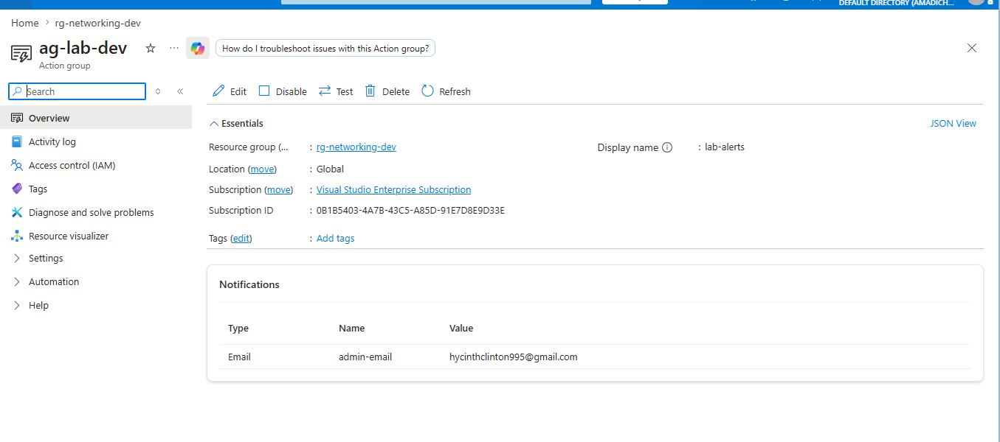
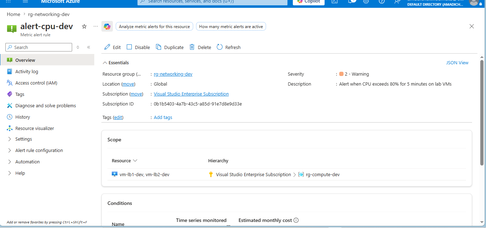
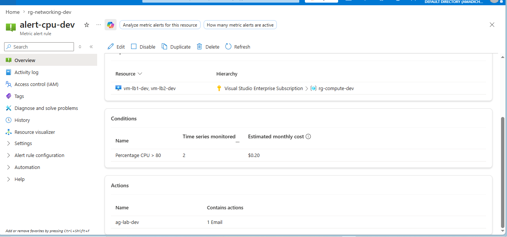
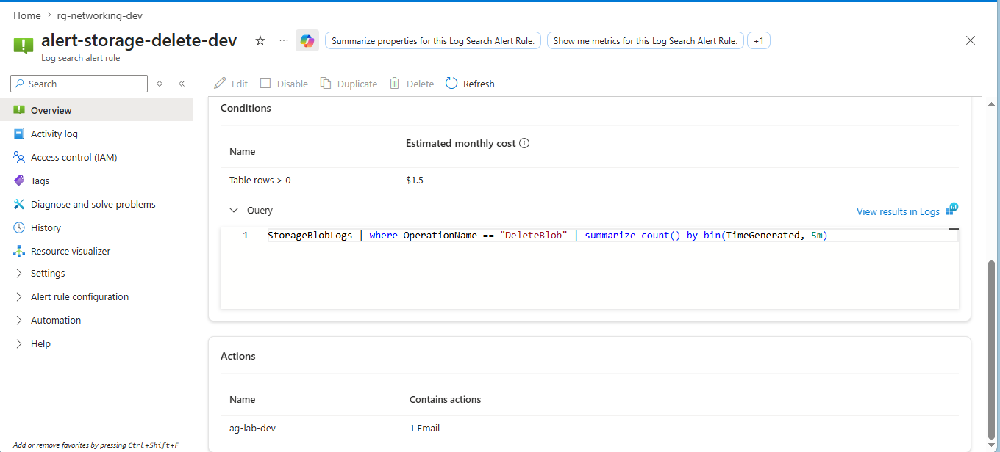
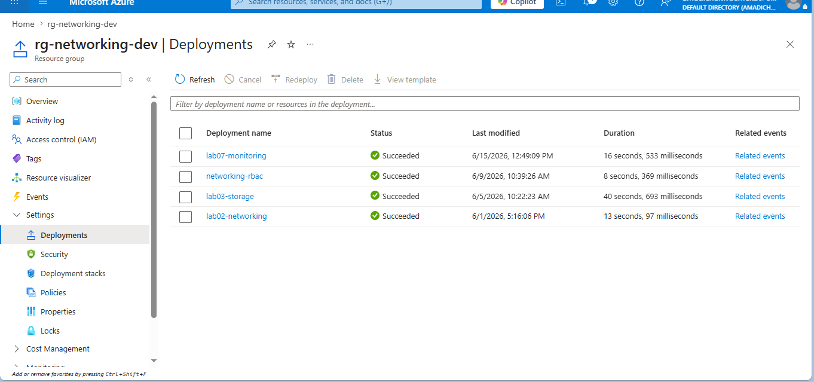

# Lab 07: Azure Monitor Alerts and Action Group

## What this lab does

Deploys two alerts and an action group into `rg-networking-dev` using Bicep:

- A metric alert watching CPU percentage on both VMs from Lab 05
- A Log Analytics query-based alert watching for blob delete operations
  on the storage account from Lab 03
- An action group that sends email notifications when either alert fires

This lab references the Log Analytics workspace created in Lab 03, the VMs
deployed in Lab 05, and the storage diagnostic settings configured in Lab 03.

## Why it matters

Infrastructure that runs without monitoring is infrastructure you are blind
to. You find out something is wrong when a user complains, not before.
Alerts move you from reactive to proactive. You know about a problem before
it affects anyone.

## Engineering decisions

**Metric alert on both VMs simultaneously:** The CPU alert uses a scopes
array to watch both VMs from Lab 05 with a single alert rule. One rule,
two resources. This is cleaner than creating a separate alert per VM and
easier to maintain.

**5 minute evaluation window for CPU:** A single CPU spike is not an
incident. Sustained high CPU over 5 minutes is. The evaluation window
filters out noise and only fires when there is a genuine problem.

**Severity 2 for CPU, severity 3 for storage deletes:** Severity reflects
urgency. High CPU on a VM is a warning that needs attention soon. A blob
delete operation is informational, worth knowing about but not urgent.

**Log Analytics query alert for storage deletes:** Metric alerts work on
numeric measurements. Detecting specific operations like blob deletes requires
querying logs. KQL gives us the flexibility to define exactly what we are
looking for.

**Action group as a shared notification target:** Both alerts point to the
same action group. If the notification destination changes, you update one
resource, not every alert individually.

**Action group deployed to global location:** Action groups are not
region-specific. They are global resources that can receive notifications
from alerts in any region.

## Resources deployed

| Resource     | Name                     | Type                                   |
| ------------ | ------------------------ | -------------------------------------- |
| Action Group | ag-lab-dev               | Microsoft.Insights/actionGroups        |
| Metric Alert | alert-cpu-dev            | Microsoft.Insights/metricAlerts        |
| Query Alert  | alert-storage-delete-dev | Microsoft.Insights/scheduledQueryRules |

## Deployment command

```bash
az deployment group create \
  --name lab07-monitoring \
  --resource-group rg-networking-dev \
  --template-file main.bicep \
  --parameters @dev.parameters.json
```

## AZ-104 alignment

- Monitor and maintain Azure resources
- Azure Monitor, metric alerts, log alerts, action groups, Log Analytics

## Evidence

### Action group with email receiver



### CPU metric alert configuration




### Storage delete query alert



### Successful deployment


