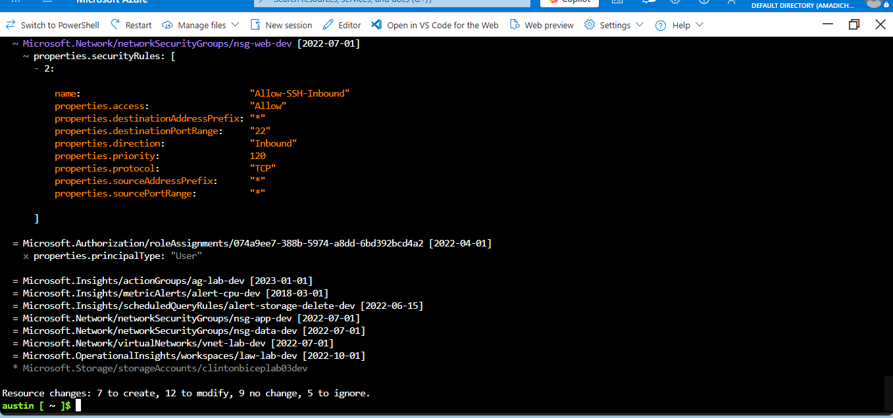
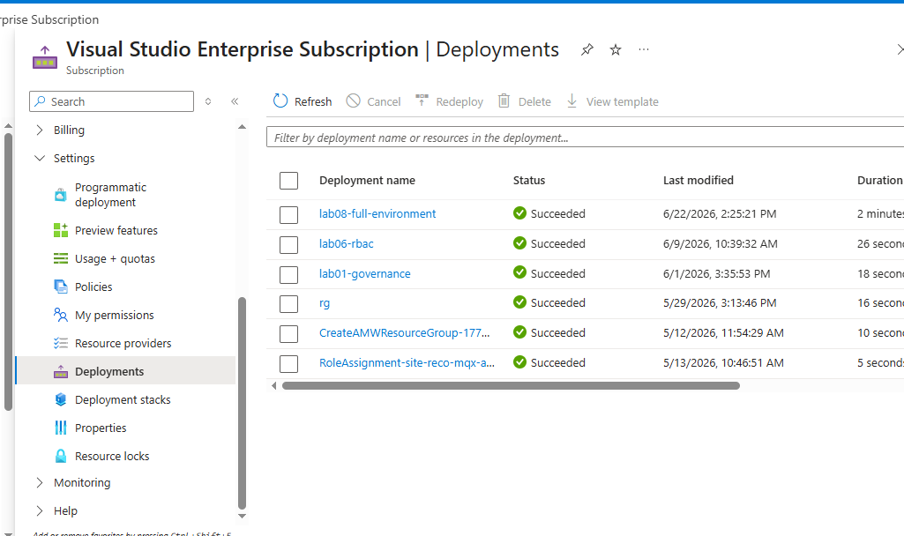
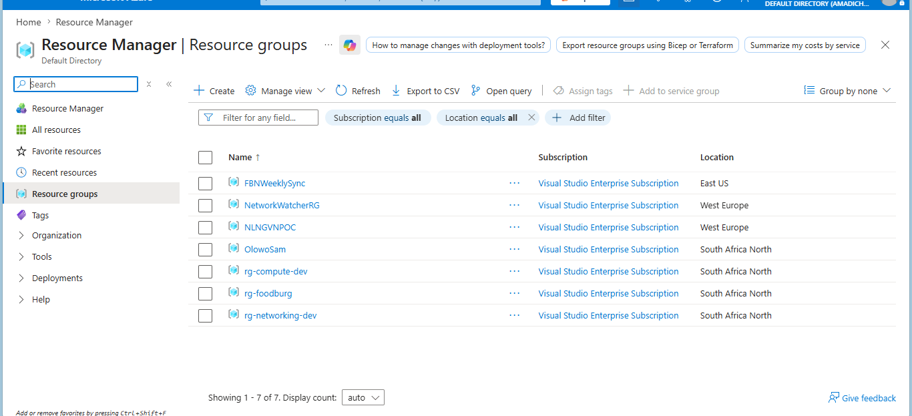
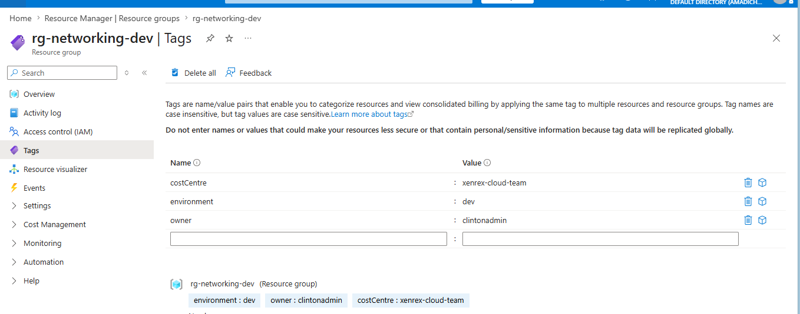
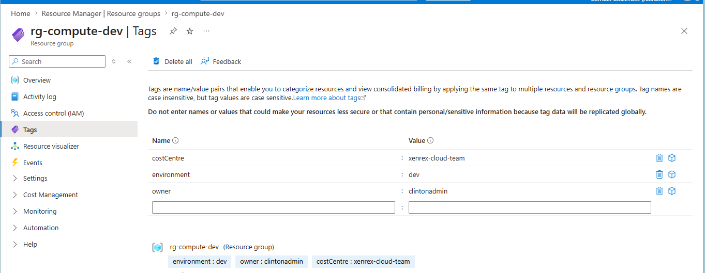
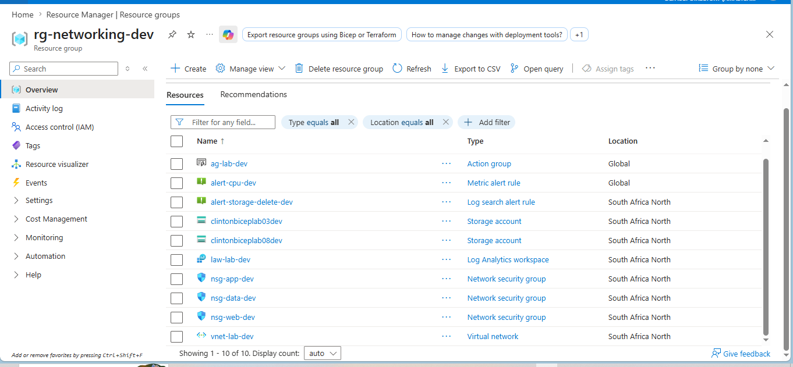
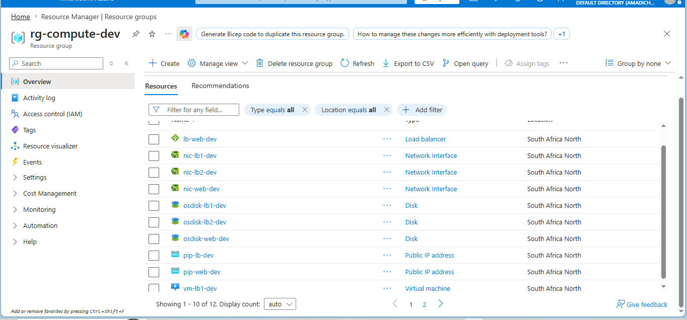

# Lab 08: Full Environment Deployment with What-If

## What this lab does

Deploys the complete lab series infrastructure in a single Bicep deployment
using a root `main.bicep` that orchestrates all previous labs as modules.
Supports both `dev` and `prod` environments through separate parameter files.

A what-if deployment is run before the final deployment to validate changes
before they are applied.

## Why it matters

Individual labs demonstrate isolated skills. This lab demonstrates the ability
to think at the environment level. A single command deploys governance,
networking, storage, compute, load balancing, RBAC, and monitoring in the
correct order with the correct dependencies. That is production-level
infrastructure as code thinking.

## Engineering decisions

**Modular architecture:** Each concern is separated into its own module.
Networking, storage, compute, load balancing, RBAC, and monitoring are all
independent modules called from a single orchestrator. This mirrors how real
enterprise Bicep deployments are structured.

**Explicit dependsOn blocks:** Azure deploys resources in parallel by default.
Without explicit dependencies, compute might try to deploy before the VNet
exists. The dependsOn blocks enforce the correct deployment order.

**Environment separation via parameter files:** The same template deploys
both dev and prod. The differences, VM size, storage account name, are
controlled entirely through parameter files. The template itself never changes
between environments.

**Standard_B1s for dev, Standard_B2s for prod:** Dev exists for testing.
It does not need production-grade compute. Prod needs more capacity to handle
real workloads. Environment-appropriate sizing is a cost management decision.

**Teardown script:** Infrastructure has a lifecycle. The teardown script
provides a clean, safe way to remove all resources when they are no longer
needed. The 10 second countdown prevents accidental deletion.

**What-if before deployment:** Running what-if before applying changes shows
exactly what will happen before it happens. In production environments this
is non-negotiable. You do not deploy blindly.

## Folder structure

lab-08-full-environment/

├── main.bicep

├── dev.parameters.json

├── prod.parameters.json

├── teardown.sh

└── README.md
modules/

├── networking.bicep

├── storage.bicep

├── compute.bicep

├── loadbalancer.bicep

├── rbac.bicep

└── monitoring.bicep

## Environment differences

| Setting         | Dev                  | Prod                  |
| --------------- | -------------------- | --------------------- |
| VM size         | Standard_B1s         | Standard_B2s          |
| Storage account | clintonbiceplab08dev | clintonbiceplab08prod |

## What-if command

```bash
az deployment sub what-if \
  --name lab08-whatif \
  --location southafricanorth \
  --template-file main.bicep \
  --parameters @dev.parameters.json
```

## Deployment command

```bash
az deployment sub create \
  --name lab08-full-environment \
  --location southafricanorth \
  --template-file main.bicep \
  --parameters @dev.parameters.json
```

## Teardown command

```bash
bash teardown.sh dev
```

## AZ-104 alignment

- All domains: governance, networking, storage, compute, identity, monitoring
- Modular Bicep, environment separation, what-if deployments

## Evidence

### What-if output



### Full deployment succeeded



### Both resource groups in portal



### Tags on rg-networking-dev



### Tags on rg-compute-dev



### Resources in rg-networking-dev



### Resources in rg-compute-dev


